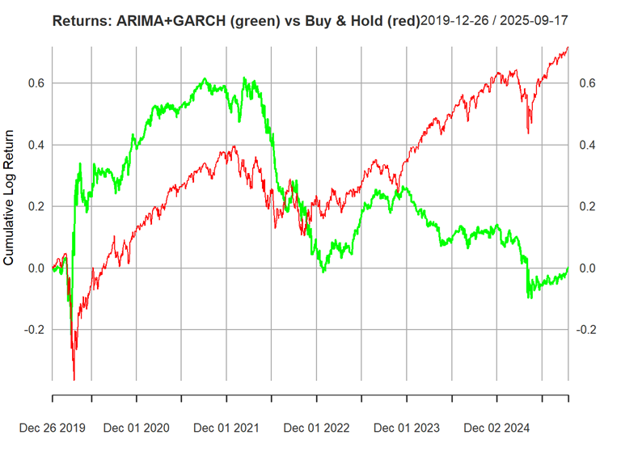

# Trading S&P 500 Using ARIMA–GARCH Model

This project applies **ARIMA–GARCH model** to daily S&P 500 returns to assess whether short-horizon forecasts can produce superior risk-adjusted performance relative to a passive Buy-and-Hold benchmark. The project demonstrates practical applications of time-series econometrics, financial forecasting, and strategy backtesting.

---

## Problem Statement

Financial time series frequently exhibit features such as autocorrelation, non-constant variance, and heavy tails. Traditional linear models fail to capture these dynamics, particularly during periods of market stress.

This project evaluates whether incorporating both conditional mean and conditional variance dynamics via ARIMA–GARCH can improve portfolio decision-making. Specifically, the analysis shows that:

- Forecasted returns can inform directional positioning,
- Volatility forecasts can enhance risk-adjusted performance metrics, and
- The final decision (Buy/ Hold/ Sell) is a combination of ARIMA mean with GARCH variance.

The motivation extends to real-world financial analytics use cases, including:

- Short-horizon signal generation
- Risk management and volatility monitoring
- Strategy evaluation and benchmarking
- Algorithmic trading research workflows

---

## Data

- Instrument: **S&P 500 Index (GSPC)**
- Source: *Yahoo Finance* via `quantmod::getSymbols()`
- Frequency: Daily close prices
- Transformation: Prices → *Log returns* `diff(log(Ad(GSPC)))`
- Handling: Removal of initial NA returns `returns_na <- na.omit(diff(log(Ad(GSPC))))`
- Period: 2018-01-01 - 2025-12-31

We selected daily log returns because they convert multiplicative price changes into an additive format. This ensures **stationarity**, satisfying a core requirement for ARIMA and GARCH modeling that raw price levels fail to meet.

---

## Methods and Modeling Approach

### Time Series Modeling

The modeling pipeline consists of:

1. **ARIMA** for conditional mean forecasts  
2. **GARCH(1,1)** for conditional variance forecasts

ARIMA order selection is performed using **AIC minimization** via `auto.arima()`. A fixed GARCH(1,1) structure is then applied to capture volatility clustering in the ARIMA residuals.

### Trading Strategy Logic

Forecasts generate next-day trading signals based on the following rules:

- **Buy (Long)** if forecasted return > 0
- **Sell (Short)** if forecasted return < 0
- **Hold** if the model fails to converge

Signals are executed on the next trading day.

### Choice of Risk-free Rate (Rf)

During the pandemic, the Federal Reserve slashed interest rates to the "zero-lower bound" to support the economy, the return on safe assets like 3-Month Treasury bills effectively vanished. The most common proxy for the risk-free rate (Rf​) is the *3-Month U.S. Treasury Bill*. 

Here is how it averaged during that window:

- 2020 (March–December): ~0.10%
- 2021 (Full Year): ~0.05%
- 2022 (January–March): ~0.30% (Rates only began rising in mid-March 2022)

**So, the estimated average Rf (Mar 2020 – Mar 2022): ~0.15% per annum**

---

## Evaluation Metric

Performance is compared against a passive **Buy-and-Hold** benchmark using **Annualized Sharpe Ratio**:

*Daily Sharpe Ratio = (mean(daily returns) - risk-free rate/ 252)/ standard deviation(daily returns)*

*Annualized Sharpe Ratio = Daily Sharpe Ratio * sqrt(252)*

Sharpe ratio is chosen because it adjusts for volatility and is a standard performance metric in quantitative finance.

---

## Results Summary

The ARIMA–GARCH strategy posted a high Sharpe ratio during the COVID-19 pandemic period between Mar 2020 and Mar 2022, indicating strong risk-adjusted performance. In contrast, the Buy-and-Hold benchmark exhibited a very low  Sharpe ratio, implying that its return over the same window was below the risk-free rate on a volatility-adjusted basis.

### Reason for Sharpe Divergence

This divergence arises because:

1. **Dynamic Risk Mitigation (GARCH)**: The model identified *volatility clustering* (i.e. *conditional heteroskedasticity*) during the pandemic. By forecasting spikes in conditional variance, it reduced exposure during high-risk periods, lowering the denominator (realized volatility) compared to the benchmark.

2. **Precision Entry/Exit (ARIMA)**: By modeling the conditional mean, the strategy captured short-term trends and "V-shaped" reversals. This allowed for consistent gains (higher numerator) while the benchmark remained stagnant during recovery phases.

3. **Drawdown Protection**: The active investment strategy using ARIMA ande GARCH successfully navigated "tail risk" events and transformed into significant *Alpha*. By reacting to statistical signals rather than holding through the crash, it avoided the deep capital erosion that led to the benchmark's negative Sharpe ratio.

With the risk-free rate near zero (0.15%), the model’s ability to maintain positive returns translated directly into significant Alpha, whereas the benchmark's return fell below the risk-free hurdle.

---

## Tools and Technologies

This project demonstrates:

- **Languages**: R
- **Libraries**: `quantmod`, `rugarch`, `timeSeries`, `tseries`
- **Skills**:
  - Financial time-series modelling
  - GARCH volatility forecasting
  - Strategy simulation & benchmarking
  - API-based data acquisition (`getSymbols` for price extraction from Yahoo Finance)
  - Statistical analysis
  - Visualization and reporting

---

## Author
Carmen Wong

